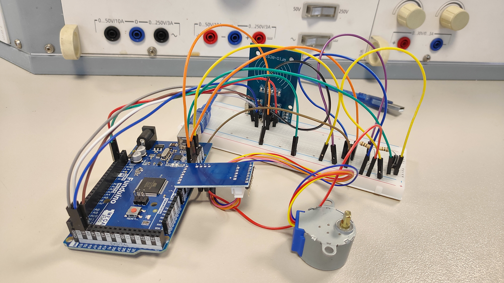

# RFID Stepper Access Controller (Arduino Mega)

This project is a simple access control system using:

- Arduino Mega 2560  
- MFRC522 RFID reader  
- 28BYJ-48 stepper motor + ULN2003 driver  
- 2 push buttons  
- LED indicator  

The system works like this:

- Scan correct RFID card → access granted  
- Press START button → stepper motor moves  
- Press RESET button → access removed  
- LED shows access status  

---

## Project Photo



---

## Components Needed

- Arduino Mega 2560  
- MFRC522 RFID module  
- 28BYJ-48 stepper motor  
- ULN2003 driver board  
- 2x push buttons  
- 10kΩ resistors (for buttons)  
- Jumper wires  
- Breadboard  

---

## Wiring

### RFID MFRC522 → Arduino Mega (SPI pins 50–53)

| RFID Pin | Mega Pin |
|----------|----------|
| SDA (SS) | 53 |
| SCK      | 52 |
| MOSI     | 51 |
| MISO     | 50 |
| RST      | 9  |
| 3.3V     | 3.3V |
| GND      | GND |

Important: MFRC522 must be powered from 3.3V (not 5V).

---

### Stepper Motor (ULN2003) → Arduino Mega

| ULN2003 Pin | Mega Pin |
|-------------|----------|
| IN1 | 4 |
| IN2 | 2 |
| IN3 | 3 |
| IN4 | 1 |
| VCC | 5V |
| GND | GND |

If the motor is weak or unstable, use an external 5V power supply.

---

### Buttons

| Function | Mega Pin |
|----------|----------|
| START    | 10 |
| RESET    | 11 |

Connection:

- One side of button → 5V  
- Other side → pin (10 or 11)  
- From that pin → 10kΩ resistor → GND  

Pressed button = HIGH

---

### LED

| LED | Mega Pin |
|-----|----------|
| Access LED | 13 |

LED ON = access granted  
LED OFF = no access  

---

## How It Works

1. System starts and waits for RFID card.
2. If scanned card UID matches the allowed UID:
   - Access is granted
   - LED turns ON
3. When access is granted:
   - Press START button → motor moves 50 steps
4. Press RESET button:
   - Access removed
   - LED turns OFF
   - Need to scan card again

---

## Changing the Allowed RFID Card

1. Upload a simple RFID reader sketch.
2. Open Serial Monitor (9600 baud).
3. Scan your card.
4. Copy the UID.
5. Replace this line in the code:

```cpp
byte allowedUID[4] = {0x43, 0x05, 0xE5, 0x35};
````

Put your card values instead.

---

## Required Libraries

Install from Arduino Library Manager:

* MFRC522
* Stepper (usually already included)

---

## Main File

* `RFID_Stepper_Access_Controller.ino` – full project code

---

## Notes

* On Arduino Mega, SPI pins are 50–53.
* If RFID does not work, make sure pin 53 is set as OUTPUT.
* If motor spins wrong direction, change IN1–IN4 order.
* If motor only vibrates, check power supply.

---

Simple workflow:

Scan card → LED ON → Press button → Motor moves → Reset to lock again.

```
